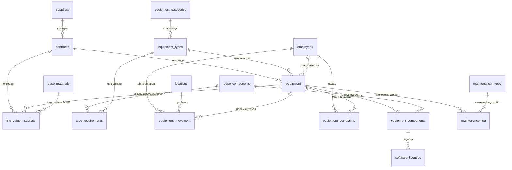

# Технічний опис бази даних обліку ІТ-активів та обладнання (mvktz)

Даний документ містить детальний опис структури, архітектури та зв'язків реляційної бази даних **mvktz**, призначеної для комплексного обліку комп'ютерної техніки, оргтехніки, ліцензійного програмного забезпечення, малоцінних матеріалів, а також моніторингу переміщень, технічного обслуговування та скарг користувачів всередині організації.

---

## 1. Загальна архітектура та концепція БД

База даних спроектована за модульним принципом і розділена на кілька ключових функціональних блоків:
1. **Нормативно-довідкова інформація (НДІ):** Постачальники, договори, матеріально відповідальні особи (співробітники), кабінети (локації) та класифікатори техніки.
2. **Облік основних засобів та комплектації:** Повузловий облік техніки (наприклад, системний блок як основна одиниця та його внутрішні компоненти).
3. **Облік витратних матеріалів:** Малоцінні та швидкозношувані предмети (МШП), що можуть прив'язуватися до конкретного обладнання (картриджі, накопичувачі тощо).
4. **Операційний блок:** Логування сервісних робіт, історія переміщення між кабінетами та фіксація інцидентів (скарг).

### ER-діаграма зв'язків (Mermaid)

---

## 2. Детальний опис таблиць та полів

### Блок 1: Довідники та службові таблиці

#### 1.1. `suppliers` (Постачальники)
Зберігає інформацію про контрагентів, які постачають обладнання чи послуги.
* **id** (INT, Primary Key, Auto Increment): Унікальний ідентифікатор постачальника.
* **supplier_name** (VARCHAR(255), NOT NULL, UNIQUE): Найменування компанії/фізособи (наприклад, *ТОВ "Ромашка"*).

#### 1.2. `contracts` (Договори)
Облік первинних документів на закупівлю.
* **id** (INT, Primary Key, Auto Increment): Унікальний ідентифікатор договору.
* **contract_number** (VARCHAR(100), NOT NULL): Номер договору/рахунку.
* **contract_date** (DATE, NOT NULL): Дата підписання.
* **supplier_id** (INT, NOT NULL): Посилання на `suppliers(id)`. Обмеження: `ON DELETE RESTRICT` (заборонено видаляти постачальника, якщо з ним є договори).

#### 1.3. `locations` (Локації / Приміщення)
Служить для просторового відстеження техніки.
* **id** (INT, Primary Key, Auto Increment): Унікальний ідентифікатор кімнати.
* **room_number** (VARCHAR(100), NOT NULL): Текстова назва/номер приміщення (наприклад, *'Кабінет 101'*, *'Серверна'*, *'Склад'*).

#### 1.4. `employees` (Співробітники)
Реєстр персоналу організації для закріплення матеріальної відповідальності.
* **id** (INT, Primary Key, Auto Increment): Унікальний код співробітника.
* **last_name** (VARCHAR(100), NOT NULL): Прізвище.
* **first_name** (VARCHAR(100), NOT NULL): Ім'я.
* **middle_name** (VARCHAR(100), NULL): По батькові.
* **position** (VARCHAR(150), NULL): Посада.
* **department** (VARCHAR(150), NULL): Підрозділ/відділ.

#### 1.5. `equipment_categories` (Категорії обладнання)
Верхній рівень класифікації заліза.
* **id** (INT, Primary Key, Auto Increment): Код категорії.
* **category_name** (VARCHAR(100), NOT NULL, UNIQUE): Назва (наприклад, *'АРМ'*, *'Звукове обладнання'*, *'Оргтехніка'*).

#### 1.6. `equipment_types` (Типи обладнання)
Уточнюючий довідник типів техніки в розрізі категорій.
* **id** (INT, Primary Key, Auto Increment): Код типу.
* **category_id** (INT, NOT NULL): Посилання на `equipment_categories(id)` (`ON DELETE RESTRICT`).
* **type_name** (VARCHAR(150), NOT NULL, UNIQUE): Назва типу (наприклад, *'Комп'ютер'*, *'Ноутбук'*, *'Принтер'*).

#### 1.7. `base_components` (Базові компоненти)
Технічний словник назв комплектуючих та модулів.
* **id** (INT, Primary Key, Auto Increment): Код базового компонента.
* **component_name** (VARCHAR(100), NOT NULL, UNIQUE): Назва вузла (наприклад, *'Процесор'*, *'Материнська плата'*, *'Картридж'*, *'ОЗП'*).

#### 1.8. `type_requirements` (Технічні вимоги до типів)
Таблиця зв'язку багатьох до багатьох (`M:N`). Визначає, з яких обов'язкових базових компонентів має складатися певний тип техніки.
* **equipment_type_id** (INT, NOT NULL): Посилання на `equipment_types(id)` (`ON DELETE CASCADE`).
* **component_id** (INT, NOT NULL): Посилання на `base_components(id)` (`ON DELETE CASCADE`).
* *Ключ*: Композитний `PRIMARY KEY (equipment_type_id, component_id)`.

---

### Блок 2: Облік основної техніки та комплектів

#### 2.1. `equipment` (Основні засоби / Обладнання)
Головна таблиця обліку інвентарних одиниць техніки.
* **id** (INT, Primary Key, Auto Increment).
* **inventory_number** (INT, NOT NULL, UNIQUE): Інвентарний або номенклатурний номер організації.
* **accounting_name** (VARCHAR(255), NOT NULL): Бухгалтерська назва об'єкта обліку.
* **technical_description** (TEXT, NULL): Додаткові технічні нотатки.
* **equipment_type_id** (INT, NOT NULL): Посилання на довідник типів техніки.
* **contract_id** (INT, NULL): Договір закупівлі (`ON DELETE SET NULL`).
* **employee_id** (INT, NULL): Поточна матеріально відповідальна особа (`ON DELETE SET NULL`).
* **purchase_date** (DATE, NULL): Дата придбання.
* **commissioning_date** (DATE, NOT NULL): Дата введення в експлуатацію.
* **status** (ENUM('В експлуатації','В ремонті','На складі','Списано','Зарезервовано'), NOT NULL): Стан об'єкта.
* **write_off_date** (DATE, NULL): Дата списання з балансу.
* **write_off_reason** (TEXT, NULL): Причина списання техніки.
* **notes** (TEXT, NULL): Довільні примітки.

#### 2.2. `equipment_components` (Специфікація / Склад обладнання)
Повузловий опис конкретного екземпляра техніки (наприклад, що саме встановлено всередині конкретного ПК).
* **id** (INT, Primary Key, Auto Increment).
* **equipment_id** (INT, NOT NULL): Посилання на батьківське обладнання `equipment(id)` (`ON DELETE CASCADE`).
* **component_type_id** (INT, NOT NULL): Тип вузла з довідника `base_components(id)`.
* **brand_model** (VARCHAR(150), NULL): Бренд та модель деталі (наприклад, *'Kingston NV2 1TB'*).
* **serial_number** (VARCHAR(100), NULL): Серійний номер виробника.
* **cartridge_model** (VARCHAR(100), NULL): Заповнюється, якщо це картридж принтера.
* **has_network** (TINYINT(1), NULL): Наявність мережевого інтерфейсу.
* **ip_address** (VARCHAR(45), NULL): Мережева IP-адреса (підтримує IPv4 та IPv6).
* **mac_address** (VARCHAR(17), NULL): Фізична MAC-адреса.
* **status** (VARCHAR(50), NULL): Поточний стан вузла.

---

### Блок 3: Малоцінка та витратні матеріали

#### 3.1. `base_materials` (Каталог матеріалів)
Довідник номенклатури витратних матеріалів та МШП.
* **id** (INT, Primary Key, Auto Increment).
* **material_name** (VARCHAR(255), NOT NULL, UNIQUE): Назва (наприклад, *'Кабель патч-корд 3м'*, *'Тонер HP 85A'*).

#### 3.2. `low_value_materials` (Облік малоцінки та витратних матеріалів)
Таблиця фактичного наявності та встановлення МШП.
* **id** (INT, Primary Key, Auto Increment).
* **material_id** (INT, NOT NULL): Посилання на найменування матеріалу `base_materials(id)`.
* **brand_model** (VARCHAR(150), NULL): Бренд / модель матеріалу.
* **equipment_id** (INT, NULL): До якого основного обладнання встановлено/видано матеріал (`ON DELETE SET NULL`).
* **contract_id** (INT, NULL): За яким договором придбано (`ON DELETE SET NULL`).
* **serial_number** (VARCHAR(100), NULL): За наявності у матеріалу власного серійного номера.
* **nomenclature_number** (VARCHAR(150), NULL): Номенклатурний номер.
* **purchase_date** (DATE, NULL): Дата придбання.
* **installation_date** (DATE, NULL): Дата встановлення/видачі в роботу.
* **quantity** (INT, NULL): Кількість одиниць.
* **notes** (TEXT, NULL).
* **status** (VARCHAR(50), NULL): Поточний стан матеріалу (наприклад, *'На складі'*, *'Видано'*, *'Списано'*).

---

### Блок 4: Ліцензії, обслуговування, скарги та переміщення

#### 4.1. `software_licenses` (Ліцензії ПЗ)
Облік ліцензійного софту, прив'язаного до конкретного заліза (комп'ютера/сервера).
* **id** (INT, Primary Key, Auto Increment).
* **component_id** (INT, NOT NULL): Прив'язка до конкретного системного блоку / компоненту через `equipment_components(id)` (`ON DELETE CASCADE`).
* **software_name** (VARCHAR(150), NOT NULL): Назва програмного продукту (наприклад, *'Windows 11 Pro'*, *'Microsoft Office 2021'*).
* **license_key** (VARCHAR(255), NULL): Ліцензійний ключ активації.
* **license_status** (VARCHAR(50), DEFAULT 'Активна').
* **expiration_date** (DATE, NULL): Дата закінчення дії підписки/ліцензії.

#### 4.2. `maintenance_types` (Види обслуговування)
Словник операцій ТО.
* **id** (INT, Primary Key, Auto Increment).
* **type_name** (VARCHAR(100), NOT NULL, UNIQUE): Назва роботи (*'Чистка ПК'*, *'Ремонт'*, *'Модернізація'*).

#### 4.3. `maintenance_log` (Журнал технічного обслуговування)
Історія всіх ремонтів та регламентних робіт з технікою.
* **id** (INT, Primary Key, Auto Increment).
* **equipment_id** (INT, NOT NULL): Посилання на `equipment(id)` (`ON DELETE CASCADE`).
* **action_type_id** (INT, NOT NULL): Тип робіт з довідника `maintenance_types(id)`.
* **action_date** (DATE, NOT NULL): Дата проведення сервісу.
* **description** (TEXT, NOT NULL): Опис виконаних дій та виявлених несправностей.
* **cost** (DECIMAL(10, 2), NULL): Вартість ремонту/обслуговування (для фінансового аналізу).

#### 4.4. `equipment_movement` (Історія переміщень)
Лог фізичної зміни розташування обладнання та зміни відповідальних осіб.
* **id** (INT, Primary Key, Auto Increment).
* **equipment_id** (INT, NOT NULL): Що переміщуємо (`ON DELETE CASCADE`).
* **location_id** (INT, NOT NULL): Куди переміщуємо (`locations(id)`).
* **employee_id** (INT, NULL): За ким закріплюємо на новому місці (`ON DELETE SET NULL`).
* **move_date** (DATE, NOT NULL): Дата переміщення.

#### 4.5. `equipment_complaints` (Журнал інцидентів / Скарг)
Облік технічних проблем, що виникають у користувачів.
* **id** (INT, Primary Key, Auto Increment).
* **equipment_id** (INT, NOT NULL): На яке саме залізо скаржаться (`ON DELETE CASCADE`).
* **complaint_date** (DATE, NOT NULL): Дата подання звернення.
* **reported_by_employee_id** (INT, NULL): Хто із співробітників зафіксував проблему (`ON DELETE SET NULL`).
* **issue_description** (TEXT, NOT NULL): Детальний опис поломки або некоректної поведінки.
* **resolution_status** (VARCHAR(50), NULL): Поточний статус заявки (*'Відкрито'*, *'В роботі'*, *'Вирішено'*).
* **resolution_date** (DATE, NULL): Дата закриття інциденту.

---

## 3. Правила забезпечення цілісності даних (Каскадність)

База даних жорстко контролює посилання між таблицями за допомогою зовнішніх ключів (`FOREIGN KEY`):
* **`ON DELETE CASCADE`** використовується для підпорядкованих таблиць, які втрачають сенс без головного об'єкта. При видаленні техніки (`equipment`) автоматично видаляться її поточні компоненти, історія її переміщень, ремонти та скарги щодо неї. Аналогічно, при видаленні компонента видаляються пов'язані з ним ліцензії ПЗ.
* **`ON DELETE SET NULL`** застосовується у випадках, коли об'єкт обліку залишається, але розривається логічний зв'язок. Наприклад, якщо співробітник звільняється (`employees` видаляється), техніка, за якою він був закріплений, отримує значення `employee_id = NULL` і вважається вільною на складі.
* **`ON DELETE RESTRICT`** блокує видалення критичних системних довідників (категорії, типи, постачальники), якщо на них посилається хоча б один діючий документ чи одиниця техніки.
